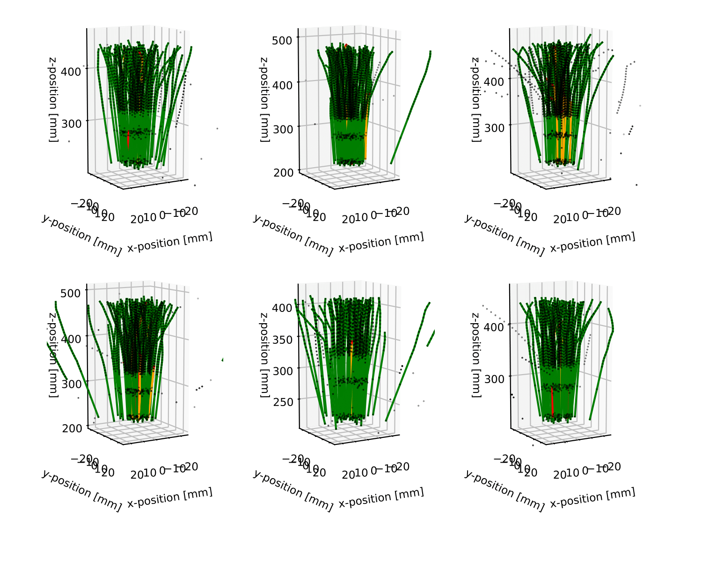

**Status:** Archive (code is provided as-is, no updates expected)

# Exploring End-to-end Differentiable Neural Charged Particle Tracking - A Loss Landscape Perspective
[Tobias Kortus](https://www.scicomp.uni-kl.de/team/kortus/), [Ralf Keidel](https://www.scicomp.uni-kl.de/team/keidel/), [Nicolas R. Gauger](https://www.scicomp.uni-kl.de/team/gauger/), on behalf of *the Bergen pCT* collaboration

The repository contains the [PyTorch](https://pytorch.org/) code for "Exploring End-to-end Differentiable Neural Charged Particle Tracking -- A Loss Landscape Perspective". The basic code structure and multiple code modules are taken from [1]. The source code for calculating hessian eigenvalues and eigenvectors is adapted from the PyHESSIAN library [3, 4] and the mode connectivity implementation is inspired by [5,6]. The baseline results for the track follower are generated using the Digital Tracking Calorimeter Toolkit [2].

> Measurement and analysis of high energetic particles for scientific, medical or industrial applications is a complex procedure, requiring the design of sophisticated detector and data processing systems. The development of adaptive and differentiable software pipelines using a combination of conventional and machine learning algorithms is therefore getting ever more important to optimize and operate the system efficiently while maintaining end-to-end (E2E) differentiability. In this work, we lay the groundwork for E2E differentiable decision focused learning for the application of charged particle tracking using graph neural networks with combinatorial components, solving a linear assignment problem for each detector layer. We demonstrate empirically that including differentiable variations of discrete assignment operations allows for efficient network optimization, working better or on par with approaches that lack E2E differentiability. In additional studies, we dive deeper into the optimization process and provide further insights from a loss landscape perspective, providing a robust foundation for future work. We demonstrate that while both methods converge into similar performing, globally well-connected regions, they suffer under substantial predictive instability across initialization and optimization methods, which can have unpredictable consequences on the performance of downstream tasks such as image reconstruction. We also point out a dependency between the interpolation factor of the gradient estimator and the prediction stability of the model, suggesting the choice of sufficiently small values. Given the strong global connectivity of learned solutions and the excellent training performance, we argue that E2E differentiability provides, besides the general availability of gradient information, an important tool for robust particle tracking to mitigate prediction instabilities by favoring solutions that perform well on downstream tasks.

<!--TODO: UPDATE BADGES-->
<a href="https://sivert.info"></a>
<a href="https://openreview.net/forum?id=1Pi2GwduEz"></a>



## Installation

```powershell
pip install -r requirements.txt
```

## Data and Models

For reproducibility we provide the user with the exact Monte-Carlo simulations used throughout the paper. All simulations can be downloaded from [Zenodo](https://zenodo.org/record/7426388) and extracted using the following command (the downloaded archive should be copied into the `data/` directory):

```powershell
tar -xf data.tar.gz --strip-components 1
```
> Note: Please note that the following instructions are provided for Linux operating systems. Some commands may vary for different operating systems.

Similarly we provide the pretrained weights, checkpoints and precomputed loss landscapes of all evaluated network variants used throughout the paper. The data can be extracted in a similar fashion using:

```powershell
tar -xf models.tar.gz --strip-components 1
```

## Training the models

All experiments with the corresponding hyperparameters parameters, performed in the paper, are documented as `.json` files. An experiment, with the provided models, can be re-run using the following commands:

```powershell
python train.py  -e experiments/****.json  -d ****
```

- `-e`: Experiment definition file. Either one of the predefined in `experiments/default`/ `experiments/ablation` or a custom definition following the json structure of the existing experiments.
- `-d`: Computation device that should be used by pytorch (cpu, cuda:0-N)

> Note: If you wish to retrain a model, the respective files should be deleted from the corresponding model directory.


## Generating Similairites and Mode Connectivity Results

```powershell
python slurm_iterate_combinations.py -t mode #Mode connectivity

python slurm_iterate_combinations.py -t cka #Fun. & repr. similarities
```

## Running Reporting Scripts

All code used for analyzing the trained models and loss landscape analysis are archived in the `reporting/` directory. A list of all scripts as well as a summary of the data generated is provided in the following script cells.

```powershell
python reporting/filter.py #Figure 8
```

```powershell
python reporting/loss_landscape.py #Figure 5 & 6
```

```powershell
python reporting/mode_connectivity.py # Table 2 & 3
```

```powershell
python reporting/performance.py #  Table 1 & Figure 4
```

```powershell
python reporting/performance_hit_graph.py #Figure 5 & Table 6
```


```powershell
python reporting/similarity.py #Figure 7
```

```powershell
python reporting/graph_size_ablation.py #Table 5
```


```powershell
python reporting/inference_speed_flops_ablation.py #Figure 11
```


```powershell
python reporting/inference_speed_ablation.py #Figure 12
```


## Referencing this Work

If you find this repository useful for your research, please cite the following work.

```
@article{kortus2025exploring,
    title={Exploring End-to-end Differentiable Neural Charged Particle Tracking {\textendash} A Loss Landscape Perspective},
    author={Tobias Kortus and Ralf Keidel and Nicolas R. Gauger},
    journal={Transactions on Machine Learning Research},
    issn={2835-8856},
    year={2025},
    url={https://openreview.net/forum?id=1Pi2GwduEz},
}
```

## References

[1] **Towards Neural Charged Particle Tracking in Digital Tracking Calorimeters with Reinforcement Learning**, T. Kortus, R. Keidel, N. R. Gauger, [Source code]: https://github.com/SIVERT-pCT/rl-tracking

[2] **Digital Tracking Calorimeter Toolkit**, H. E.S. Pettersen, [Sorce code]: https://github.com/HelgeEgil/DigitalTrackingCalorimeterToolkit

[3] **PyHessian**, Z. Yao, A. Gholami, K Keutzer, M. Mahoney, [Source Code] https://github.com/amirgholami/

[4] Z. Yao, A. Gholami, K Keutzer, M. Mahoney. PyHessian: Neural Networks Through the Lens of the Hessian, Spotlight at ICML workshop on Beyond First-Order Optimization Methods in Machine Learning, 2020

[5] **Mode Connectivity and Fast Geometric Ensembling**, T. Garipov, P. Izmailov, D. Podoprikhin, D. Vetrov and A. G. Wilson [Source Code]: https://github.com/timgaripov/dnn-mode-connectivity

[6] T. Garipov, P. Izmailov, D. Podoprikhin, D. Vetrov and A. G. Wilson. Mode Connectivity and Fast Geometric Ensembling, NIPS 2018, Spotlight (2018)